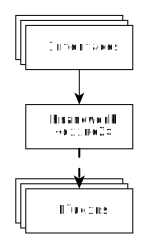
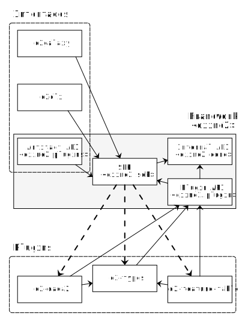
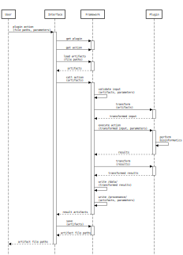

Architecture Overview
=====================
.. contents::
   :local:

The goal of this document is to give the reader a high-level understanding of the components of QIIME 2, and how they are inter-related.

At the highest level, there are three kinds of components in QIIME 2:

  - The interfaces, which are responsible for translating user intent into action.
  - The framework, whose behavior and purpose will be described in further detail below.
  - The plugins, which define *all* domain-specific functionality.

   Interfaces only interact with plugins through the framework, which will invoke plugin behavior as needed.
   Solid arrows are direct dependency.
   Dash-dotted arrows are a deferred dependency (via entry-point).

The above diagram illustrates the most important restriction of the architecture.
Interfaces cannot and *should not* have any particular knowledge about plugins ahead of time.
Instead they must request that information from the framework, which provides a high-level description of all of the actions available via SDK (Software Development Kit) objects.

At first glance, this restriction may seem onerous.
However, because interfaces cannot communicate directly with plugins, they also never need to coordinate with them.
This means interfaces are entirely decoupled from the plugins and more importantly, plugins are always decoupled from interfaces.
A developer of a plugin, does not need to concern themselves with providing any interface-specific functionality, meaning development of both plugins and interfaces can be done in parallel.
Only changes in the framework itself require coordination between the other two component types.
This key constraint coupled with a set of semantically rich SDK objects allows *multiple* kinds of interfaces to be dynamically generated.
This allows QIIME 2 to adapt its UI to both the audience and the task at hand.

Detailed Component Diagram
--------------------------
A more complete version of the above figure is found below:

   Solid arrows are a direct dependency.
   Dash-dotted arrows are a deferred dependency (via entry-point).
   Dashed rounded boxes surrounding other components indicate a group of like-components.
   The larger gray box indicates a nested component, containing sub-components.
   Text within angle-brackets (`<>`) indicate a Python package/import name.

Here we observe that interfaces use a particular sub-component of the framework called the SDK.
We also see that one of the interfaces is built into the framework itself (the Artifact API), however it is not any more privileged compared to any of the other interfaces, and none of the other interfaces use it directly.

Looking now at the plugins we see that they use a sub-component of the framework called the Plugin API.
This is responsible for constructing and registering the relevant SDK objects for use by interfaces.
We also see that plugins can depend on other plugins.

At this point the rough picture of how an interface uses a plugin can be seen.
Plugins are loaded by the framework's SDK via an entry-point (more on that later).
This in turn causes the plugin code to interact with the Plugin API, which constructs SDK objects.
These SDK objects are then introspected and manipulated by any number of Interfaces.

Following A Command Through QIIME 2
-----------------------------------
To get a better idea of where the responsibility of these components starts and ends, we can look at a sequence diagram describing the execution of an action by a user.

   This diagram is read from top to bottom, which indicates the passage of some non-specific amount of time.
   Components are vertical columns.
   An activated state of a component is indicated by a narrow box.
   Components can perform actions either upon other components, or upon themselves.
   These actions are denoted with a solid arrow pointing at the actor in question.
   The label indicates what action is performed and, when provided, parenthesis indicate some kind of argument that is provided.
   Not all arguments are enumerated for brevity.
   Results of an action are denoted with a dashed arrow and are usually labeled with the result's name.

This figure has four components: a User, an Interface, the Framework, and a Plugin.
We see first, a User invoking some action with some files and parameters.
The Interface receives this and is activated.
It locates the plugin and the action requested from the Framework, receiving SDK objects (not shown).
Then it loads the provided files as QIIME 2 Artifacts.
It is then ready to call the action (an SDK object) with the User's artifacts and parameters.

The Framework then provides some input validation (it is much faster to check that the data provided will work for the action requested than to fail halfway through a very long process, requiring the User to start over).
The Framework then identifies what format the data should be in, and invokes relevant code defined by a Plugin (though not necessarily the same one) for converting that data.
Finally, with validated input and a compatible format, the data is provided to the plugin to perform whatever task the User intended.

Once finished, the Plugin returns the results and the Framework will again convert that data into a particular format for storage using a Plugin.
The Framework then writes that data into an archive (as `/data/`) and records what steps just occurred (in `/provenance/`).
This completed archive is now an artifact and is returned to the Interface.
The Interface decides to save the artifact to a file and then returns that to the User.

Summary
-------
In this example we see that the activation of each component is strictly nested.
It forms a sort of "onion of responsibility" between the component layers.
We also note that the Interface waits for the task to finish before becoming inactive; there are other modes of calling actions which are asynchronous and can be used instead.
In either case, we see that each component is successively responsible for less tasks which become more specific as we move to the right.

The end result is:
  - The Interface need only care about communicating with the User.
  - The Plugin need only care about manipulating data to some effect.
  - The Framework concerns itself with coordinating the overall effort and recording the data surrounding the action.
