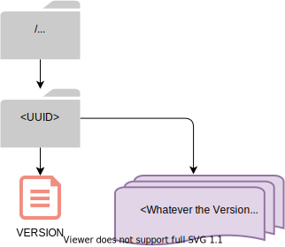
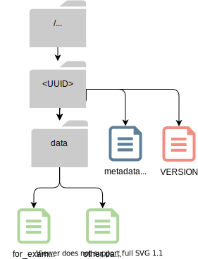
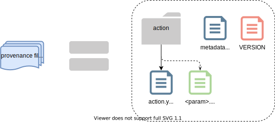
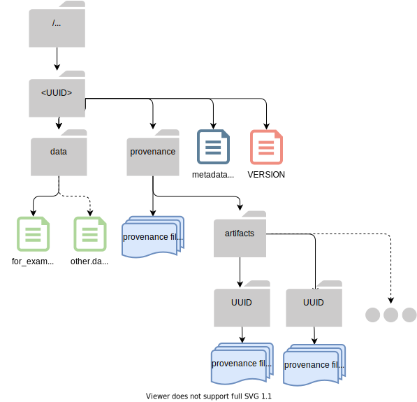
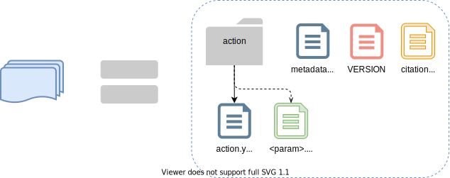
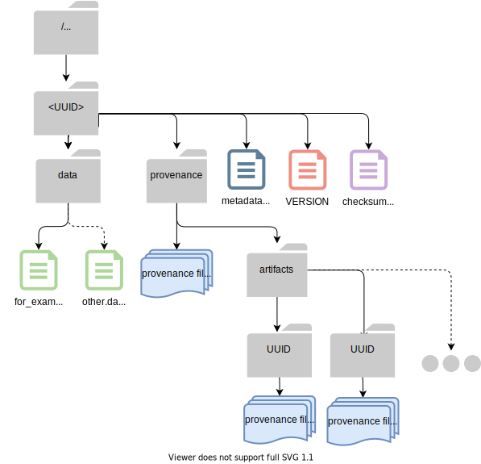

Archive Versions
================
.. contents::
   :local:

The structure of QIIME 2 :term:`archives<Archive>` has evolved as QIIME 2 has been developed.
This page describes each historical version of the QIIME 2 Archive format,
and may be useful to interface developers whose code depends on guarantees made by that format
(`source code <https://github.com/qiime2/qiime2/blob/master/qiime2/core/archive/>`_).

For general information about the structure of current QIIME 2 Archives, see :doc:`archive`.
For a detailed description of the part of an Archive which holds Provenance data, see :doc:`provenance`.

Version-agnostic format "guarantees"
------------------------------------

Though there is significant variability in the format of QIIME 2 Archives across archive versions,
all archive versions share some common traits.

These shared characteristics, defined in the ``_Archive`` class in
`qiime2/core/archive/archiver.py <https://github.com/qiime2/qiime2/blob/master/qiime2/core/archive/archiver.py>`_,
must be consistent across all formats over time, 
as they allow archive versions to be checked,
and archives with different formats to be dispatched to the appropriate version-specific tools.

All QIIME 2 Archives have:

- a directory named with the Archive UUID, directly under the archive root at ``/<UUID>/``
- a file ``/<UUID>/VERSION`` within that directory, formatted as shown below

The Archive file system must look like this:

The VERSION file must look like this:

.. code-block::

    QIIME 2
    archive: <archive version>
    framework: <framework version>

.. note::
   This file is intentionally not in YAML, INI,
   or any other common data serialization or configuration format.
   This is to discourage the situation where important archive files are reformatted
   from YAML to another format and VERSION is updated "for consistency",
   breaking backwards compatibility.

Version 0
---------

The original QIIME 2 Archive format, there aren't many V0 Archives "in the wild".
V0 Archives were produced by Alpha versions of the QIIME 2 framework,
and were superseded in framework version 2.0.6 on 10/24/16.

- :term:`Result` data files are written in the directory ``/<UUID>/data``
- | Result UUID, Semantic Type, and Format information are saved in
  | ``/<UUID>/metadata.yaml``.
- The ``ArchiveFormat`` class in
  `v0.py <https://github.com/qiime2/qiime2/blob/master/qiime2/core/archive/format/v0.py>`_
  offers convenience methods for loading and parsing ``metadata.yaml`` files.

V0 Archives look like this:

Version 1
---------

Released in QIIME 2 `version 2.0.6 <https://github.com/qiime2/qiime2/releases/tag/2.0.6>`_,
`commit bdc8aed <https://github.com/qiime2/qiime2/commit/bdc8aed08a7ce323a0f9901c6ff634680e58c7f3>`_,
Version 1 Archives introduce decentralized provenance tracking to QIIME 2.
`ArchiveFormat V1 <https://github.com/qiime2/qiime2/blob/master/qiime2/core/archive/format/v1.py>`_
inherits all traits of v0,
modifying its ``__init__()`` and ``write()`` methods only to add provenance capture.

.. note::
   All ``ArchiveFormat`` versions subclass their predecessor.

   E.g. the ``ArchiveFormat`` in ``v1.py`` inherits from the ``ArchiveFormat`` in ``v0.py``,
   etc. This makes it easier for humans to interpret the version history.

Provenance data is stored in the directory ``/<UUID>/provenance/``.
Specifically, ``metadata.yaml``, ``action.yaml`` and ``VERSION`` files
are captured for the current Result and each of its ancestors.
Each Result's ``action.yaml`` file and associated data artifacts (e.g. sample metadata)
are stored in an ``action`` directory alongside that Result's ``VERSION`` and ``metadata.yaml``.
Considered together, we can describe these as "provenance files".

   The blue "multiple files" icon represents all provenance files associated with a single action
   (e.g. the current action, or one of its ancestors).
   For a detailed description, see :doc:`provenance`.

V1 Archives look like this:

   Provenance files for the current Result are stored in ``/<UUID>/provenance/``.
   Provenance files for each ancestor Result are stored in directory at
   ``/<root_UUID>/provenance/artifacts/<ancestor_UUID>/``

.. note::

   V0 Archives do not capture provenance data. As a result, if a V0 artifact is 
   an ancestor to a V1 (or greater) artifact, it is possible for the `action.yaml`
   to list Artifact UUIDs which are not present in the `artifacts` directory.

Version 2
---------
Released across QIIME 2 versions `2017.9 <https://github.com/qiime2/qiime2/releases/tag/2017.9.0>`_
(`changelog <https://forum.qiime2.org/t/qiime-2-2017-9-release-is-now-live/1160>`__)
and `2017.10 <https://github.com/qiime2/qiime2/releases/tag/2017.10.0>`_
(`changelog <https://forum.qiime2.org/t/qiime-2-2017-10-release-is-now-live/1626>`__),
the directory structure of this format is identical to v1,
but the ``action.yaml`` file has changed.

In `commit 4389a0b <https://github.com/qiime2/qiime2/commit/4389a0b4ec41151144188ea230c8c56c1940c368>`_,
the Version 2 ``ArchiveFormat`` adds an ``output-name`` key to the ``action`` section of ``action.yaml``
(unless the action type is ``import``),
assigning it the output name registered to the relevant action.
Prior to this change, if one action returned multiple artifacts of the same :term:`Semantic Type`,
it was not possible to differentiate between them using provenance alone.

In `commit e072706 <https://github.com/qiime2/qiime2/commit/e07270659bd4089afdeef744868f8b7ac9c698a9>`_,
it adds provenance support for :term:`Pipelines <Pipeline>`,
adding the ``alias-of`` key to the ``action`` section of ``action.yaml``.
See description in :ref:`action-block` for details.

Version 3
---------

Released in QIIME 2 version `2017.12 <https://github.com/qiime2/qiime2/releases/tag/2017.12.0>`_
(`changelog <https://forum.qiime2.org/t/qiime-2-2017-12-release-is-now-live/2308>`__),
`commit 684b8b7 <https://github.com/qiime2/qiime2/commit/684b8b77276bd8fc7228042c674a166669bb5bef>`_,
the directory structure of this format is identical to v1 and v2.

With this release, QIIME 2 Actions are able to take variadic arguments,
allowing users to pass collections of Artifacts (``List`` s and ``Set`` s).
A YAML representer has been added so that ``action.yaml`` can represent ``Set`` s of Artifact inputs.
These will show up in ``action.yaml`` as custom ``!set`` tags.

Version 4
---------

Released in QIIME 2 version `2018.4 <https://github.com/qiime2/qiime2/releases/tag/2018.4.0>`_
(`changelog <https://forum.qiime2.org/t/qiime-2-2018-4-release-is-now-live/3946>`__),
`commit 00a294c <https://github.com/qiime2/qiime2/commit/00a294cbfc8737c1a2f57d695615098dc9beb4ad>`_,
this format adds citations to the directory format,
adds a ``transformers`` section to ``action.yaml``,
and aligns the structure of ``environment:framework`` (also in ``action.yaml``)
to match the structure of ``environment::plugins::<some_plugin>``.

Whenever an Action is run, its registered citations are captured.
When saved, they are written to a ``citations.bib`` file
inside the Archive's ``provenance`` directory.
Citations for all of the current Result's ancestors are stored in their respective <UUID> directories
(e.g. ``/<root_UUID>/provenance/artifacts/<ancestor_UUID>/citations.bib``).

**The overall directory structure remains identical to a v1 archive, above.**

Result-specific citation tags are also written to
the ``transformers`` and ``environment`` sections of the ``action.yaml`` files,
for the current Result and for all ancestors with registered citations.
A new custom ``!cite '<citation key>'`` tag is use to support this in YAML.

A ``transformers`` section is added between the ``action`` and ``environment`` sections of ``action.yaml``.
Because Pipelines do not use transformers,
transformers will be recorded only for :term:`Methods <Method>`, :term:`Visualizers <Visualizer>`,
and when importing data with ``qiime tools import``.
It looks like this:

.. code-block:: YAML

   transformers:
    inputs:
        demultiplexed_seqs:
        -   from: SingleLanePerSamplePairedEndFastqDirFmt
            to: SingleLanePerSamplePairedEndFastqDirFmt
    output:
    -   from: q2_types.feature_data._transformer:DNAIterator
        to: DNASequencesDirectoryFormat
        plugin: !ref 'environment:plugins:types'

``environment::framework`` was previously only a version string,
and is now structured identically to each plugin action's ``software_entry``,
with version, website, and citation sections:

.. code-block:: YAML

   framework:
      version: 2019.10.0
      website: https://qiime2.org
      citations:
      - !cite 'framework|qiime2:2019.10.0|0'
   plugins:
      fragment-insertion:
          version: 2019.10.0
          website: https://github.com/qiime2/q2-fragment-insertion
          citations:
          - !cite 'plugin|fragment-insertion:2019.10.0|0'
          ...

Version 5
---------

Released in QIIME 2 version `2018.11 <https://github.com/qiime2/qiime2/releases/tag/2018.11.0>`_
(`changelog <https://forum.qiime2.org/t/qiime-2-2018-11-release-is-now-live/6879>`__),
`f95f324 <https://github.com/qiime2/qiime2/commit/f95f3246517e8c79bdab6b000d23f801030485e2>`_,
this format version adds archive checksums to the directory structure.

A new, md5sum-formatted checksum file has been added at ``/<root_UUID>/checksums.md5``,
with one md5sum and one filename on each line. For a more detailed specification, see the
`PR <https://github.com/qiime2/qiime2/pull/414>`_.

Checksums.md looks like this:

.. code-block:: YAML

   5a7118c14fd1bacc957ddf01e61491b7  VERSION
   333fd63a2b4a102e58e364f37cd98b74  metadata.yaml
   4373b96f26689f78889caeb1fbb94090  data/faith_pd-cat1.jsonp

   ...

   7a40cff7855daffa28d4082194bdf60e  provenance/artifacts/f6105891-2c00-4886-b733-6dada99d0c81/metadata.yaml
   ae0d0e26da5b84a6c0722148789c51e0  provenance/artifacts/f6105891-2c00-4886-b733-6dada99d0c81/action/action.yaml

V5 Archives look like this:

