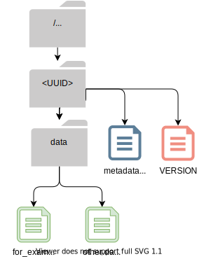

Archive Versions
================
.. contents::
   :local:

As QIIME 2 has developed, the structure of QIIME 2 :term:`archives<Archive>` has evolved.
This page describes each historical version of the QIIME 2 Archive format,
and may be useful to developers whose code depends on guarantees made by that format
(`source code <https://github.com/qiime2/qiime2/blob/master/qiime2/core/archive/>`_).

For general information about the structure of current QIIME 2 Archives, see :doc:`archive`.
For a detailed description of the part of an Archive which holds Provenance data, see :doc:`provenance`.

Version-agnostic format "guarantees"
------------------------------------

Though there is significant variability in the format of QIIME 2 Archives across versions,
all versions share some common traits.

These shared characteristics, defined in the ``_Archive`` class
in `qiime2/core/archive/archiver.py <https://github.com/qiime2/qiime2/blob/master/qiime2/core/archive/archiver.py>`_,
must be consistent across all formats over time, 
as they allow archive versions to be checked,
and archives with different formats to be dispatched to the appropriate version-specific tools.

All QIIME 2 Archives have:

- a directory named with the Archive UUID, directly under the archive root.
- a file within that directory named VERSION, formatted as shown below

The Archive file system must look like this:

The VERSION file must look like this::

    QIIME 2
    archive: <archive version>
    framework: <framework version>

.. note::
   This file is itentionally not YAML/INI/An actual format. This is to
   discourage the situation where the format changes from something like YAML to
   another format and VERSION is updated with it "for consistency".

Version 0
---------

The original QIIME 2 Archive format, there aren't many V0 Archives "in the wild".
V0 Archives, in place through 10/24/16, were produced only during QIIME 2's Alpha release,
prior to version 2.0.6.

- Like all QIIME 2 Archives, there is a directory named with the Archive UUID under the archive root, containing a VERSION file. (This is *not* format-defined. See above.)
- :term:`Result` data is written to a ``data`` directory, located within this UUID directory.
- Result UUID, Semantic Type, and Format go in a ``metadata.yaml`` in the same place.
- The ArchiveFormat class in `v0.py <https://github.com/qiime2/qiime2/blob/master/qiime2/core/archive/format/v0.py>`_ offers convenience methods for loading and parsing ``metadata.yaml`` files.

V0 Archives look like this:

Version 1
---------

Created in `PR #171 <https://github.com/qiime2/qiime2/pull/171>`_,
Version 1 Archives introduce decentralized provenance tracking to QIIME 2.
`ArchiveFormat V1 <https://github.com/qiime2/qiime2/blob/master/qiime2/core/archive/format/v0.py>`_ inherits all traits of v0,
modifying its ``__init__()`` and ``write()`` methods only to add provenance capture.

- A ``provenance`` folder is written in the top-level UUID directory
- ``citations.bib``, ``metadata.yaml``, ``action.yaml`` and ``VERSION`` files are captured for the current Result and all ancestors.
- The ``action.yaml`` file and associated data artifacts (e.g. sample metadata) are stored in an ``action`` directory.
- For the current Result, all of this captured data lives directly inside ``provenance``
- These files for all ancestor Results are placed in UUID-labeled subdirectories of an ``artifacts`` folder, inside ``provenance``

.. note::
   For simplicity, all provenance files are represented here as purple "multiple files" icons. 
   For a more comprehensive description and images, see :doc:`provenance`.

# TODO: MAKE THIS VIZ - should look like the simplified one in provenance.rst, but without checksums

V1 Archives look like this:

.. figure:: ../img/v1_archive_fmt.svg
   :alt: Box and Arrow diagram of a v1 archive, as described above.

.. note::

   V0 Archives do not capture provenance data. As a result, if a V0 artifact is 
   an ancestor to a V1 (or greater) artifact, it is possible for the `action.yaml`
   to list Artifact UUIDs which are not present in the `artifacts` directory.

Version 2
---------
In terms of directory structure, this format is exactly the same as v1,
but the ``action.yaml`` file has changed.

In `PR #333 <https://github.com/qiime2/qiime2/pull/333>`_, 
the Version 2 ArchiveFormat adds an ``output-name`` key to the ``action`` section of ``action.yaml``
(unless the action type is ``import``),
assigning it the output name registered to the relevant action.
Prior to this change, if one action returned multiple artifacts of the same :term:`Semantic Type`,
it was not possible to differentiate between them using provenance alone.

In `PR #348 <https://github.com/qiime2/qiime2/pull/348>`_,
it adds provenance support for :term:`Pipelines`,
adding the ``alias-of`` key to the ``action`` section of ``action.yaml``.
See description in :ref:`action-block` for details.

# TODO: MAKE THIS VIZ - should look like the simplified one in provenance.rst, but without checksums

V2 Archives look like this:

.. figure:: ../img/v2_archive_fmt.svg
   :alt: Box and Arrow diagram of a v2 archive, as described above.

Version 3
---------

This happened after 0

Version 4
---------

This happened after 0

Version 5
---------

This happened after 0