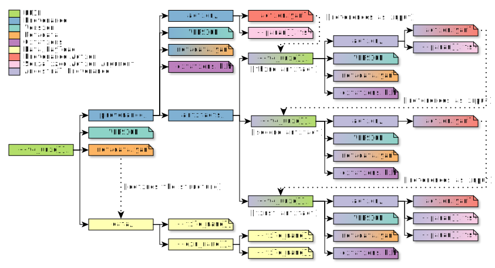

Anatomy of an Archive
=====================
.. contents::
   :local:

QIIME 2 stores data in a directory structure called an :term:`Archive`.
These archives are zipped to make moving data simple and convenient.

The directory structure has a single root directory named with a :term:`UUID` which
serves as the :term:`identity` of the archive. Additional files and directories
present in the archive are described below.

The Most Important File
-----------------------
In the root of an :term:`archive` directory,
there is a file named ``metadata.yaml``.
This file describes the :term:`type`,
the :term:`directory format`,
and repeats the :term:`identity` of a piece of data.

An example of this file:

.. code-block:: YAML

   uuid: 45c12936-4b60-484d-bbe1-98ff96bad145
   type: FeatureTable[Frequency]
   format: BIOMV210DirFmt

It is possible for ``format`` to be set as ``null`` in some cases;
it means the ``/data/`` directory  (described below) does not have a schema.
This occurs when the ``type`` is set as ``Visualization`` (representing a :term:`Visualization (Type)`).

Data Goes In /data/
-------------------
Where data is stored, the :term:`payload` of an archive,
is in an aptly named ``/data/`` subdirectory.
The structure of this subdirectory depends on the payload.

If the archive is a :term:`visualization`,
then the payload is an interactive visualization implemented as a small static website
(with an ``index.html`` file and any other assets).
Additional information about visualizers can be found here: :doc:`../actions/visualizers`.

If the archive is an :term:`artifact`,
then the payload is determined by the :term:`directory format`.
Additional information about directory formats can be found here: :doc:`formats`.

Provenance Goes In /provenance/
-------------------------------
In addition to storing data, we can store *metadata* containing information
such as what actions were performed, what versions exist, what references to
cite. A more complete description can be found in :doc:`provenance`.

As it relates to the archive structure, the ``/provenance/`` directory is designed
to be self-contained and self-referential. This means that it duplicates some
of the information available in the root of the :term:`archive`, but this
simplifies the code responsible for tracking and reading provenance.

To better illustrate this idea, we can look at the following diagram,
representing an archive:

Looking closely we see the previously described ``/data/`` directory and
``metadata.yaml`` file, in addition to a ``VERSION`` file (described below)
and the ``/provenance/`` directory in question.

Following the provenance directory, we see that the provenance structure is
repeated within the ``/provenance/artifacts/`` directory.
This directory contains the *ancestral provenance* of all :term:`artifacts<Artifact>`
used up to this point. Because the structure repeats itself, it is possible to
create a new provenance directory by simply adding all input artifacts' ``/provenance/``
directories into a new ``/provenance/artifacts/`` directory.
Then the ``/provenance/artifacts/`` directories of the original inputs can be also merged together.
Because the directories are named by a :term:`UUID`, we know the :term:`identity` of each ancestor,
and if seen twice, can simply be ignored.
This simplifies the problem of capturing *ancestral provenance* to one of merging
uniquely named file-trees.

Why a ZIP File?
---------------
ZIP files are a ubiquitous and well understood format.
There is a huge variety of software available to read and manipulate ZIP files.

The ZIP format enables random access of files within the archive making it
possible to read data without extracting the entire contents of the ZIP file
(in contrast to a linear archive like TAR).

.. admonition:: Maintainer Note
   :class: maintainer-note

   ``qiime2.core.archive.archiver:_ZipArchive`` is the structure responsible for
   managing the contents of a ZIP file (using ``zipfile:ZipFile``).

Rules for identifying an archive
--------------------------------
Every QIIME 2 :term:`archive` has the following structure:

A root directory which is named a standard representation of a UUID (version 4),
and a file within that directory named ``VERSION``.

The :term:`UUID` is the :term:`identity` of the archive, while the ``VERSION`` file provides
enough detail to determine how to parse the rest of the archive's structure.

Within ``VERSION`` the following text will be present::

  QIIME 2
  archive: <integer version>
  framework: <version string>

.. admonition:: Maintainer Note
   :class: maintainer-note

   This file is NOT YAML (and shouldn't be). The goal is to avoid it being caught
   up by a future refactor where some other structured file format is used instead
   of YAML (we do like YAML however). Additionally, line-endings are currently
   unspecified, but in practice will be UNIX-style.

Where ``<integer version>`` is the version that the archive was saved with.
This may be used to identify the *schema* of the archive structure,
allowing software to dispatch appropriate parsing logic.

As a historical example, archive version '``0``' had no ``/provenance/`` directory.
This means there is no reason to look for it in the archive.
Admittedly it is just as easy to check if the directory exists,
however this pattern can be used for more complex cases.

.. admonition:: Maintainer Note
   :class: maintainer-note

   These rules are encoded in ``qiime2.core.archive.archiver:_Archive``
