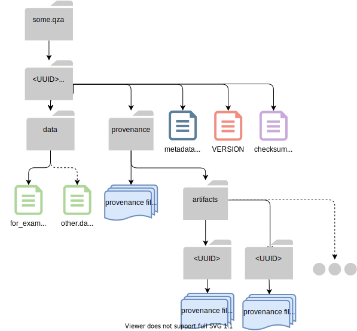
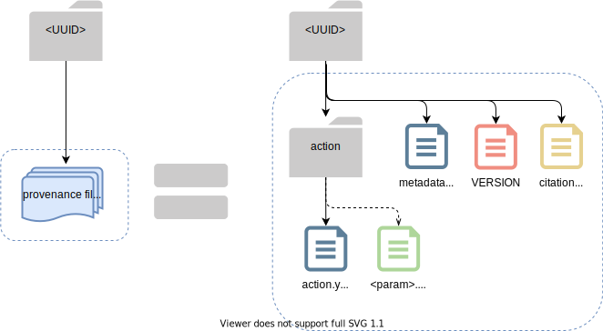

Decentralized Provenance Tracking
=================================
.. contents::
   :local:

QIIME 2 provides automatic, integrated, and decentralized tracking of analysis
metadata, including information about the host system, the computing
environment, Actions performed, parameters passed, primary sources cited, and
more. We describe all of this information about "how an analysis was
performed" as "provenance".

The notion of a QIIME 2 :term:`Result` is central here. Whenever an
:term:`Action` is performed on some data with QIIME 2, the framework
captures relevant metadata about the action and environment and stores it in
the Action's Result. When/if that Result is saved as an :term:`Archive`, the
captured provenance data is stored within the Archive as well.
:ref:`provenance-structure` contains a detailed discussion of the
file structure which holds provenance metadata.

.. note::
   *When* Results are saved as Archives is interface-defined.
   Results are saved automatically by ``q2cli``, every time a user runs a command.
   They must be saved manually by users of the `Artifact API <https://docs.qiime2.org/2021.4/interfaces/artifact-api/>`_.
   This allows API uses to reduce I/O, and keeps things simpler for CLI users.

Why Capture Provenance Data?
----------------------------

Provenance gives QIIME 2 users, paper reviewers, and developers valuable
tools for zero-cost documentation, study validation and reproduction,
workflow pipelining, and software maintenance and repair.

Among the benefits of this model are:

- Analyses are *fully* reproducible.
- Analyses self-document, reducing the need for investigator notetaking.
  For example, `q2view <https://view.qiime2.org/>`_ produces directed provenance graphs.
  QIIME 2 Artifacts bring their citations with them.
  Methods-section text could theoretically be generated
  from a collection of QIIME 2 Artifacts.
- Analyses are replay-able.
  The QIIME 2 team is developing functionality to generate executable scripts
  from prior results, simplifying the repetition of analyses.
- In the unlikely event of a data integrity bug, problematic combinations of hardware,
  environment, Action, and parameters can be investigated effectively.
  Impacted results can be programatically identified, and could be programatically
  correctable in some cases.

By capturing provenance metadata at the level of Actions/Results, QIIME 2
provenance is both host- and interface-agnostic. In other words, a QIIME 2
analysis can be performed across various host systems, using whatever interfaces
the user prefers, without compromising the validity of the analysis or the
provenance. The Result of every step in the analysis contains its own
unique history.

What Provenance Data is Captured?
---------------------------------

In order to focus on provenance data, we will consider a relatively simple QIIME 2
example Archive structure, with limited non-provenance content. Below the
outer :term:`UUID` directory, this :term:`Artifact` holds the data it
produced in a ``data`` directory (:ref:`data-goes-in-data`), and a few "clerical"
files treated at greater length in :doc:`/storing-data/archive`.


         emphasizing how an Archive holds provenance for an arbitrary number of Actions

All that's left to discuss is the ``provenance/`` directory. In the diagram
above, we use a blue "multiple-files" icon to represent the collection of
provenance data associated with one single QIIME 2 action. When this icon appears
directly within ``provenance/`` the files describe the "current" :term:`Result`.
All remaining icons appear within the ``artifacts/`` subdirectory. These file
collections describe all "parent" Results used in the creation of the current Result,
and are housed in directories named with their respective UUIDs.


         with a single "multiple-files" icon.

With the exception of the current Result (whose provenance lives in ``provenance/``,
every Action is captured in a directory titled with the Action's :term:`UUID`. 
That directory contains:

- ``VERSION``: :ref:`identifying-an-archive`
- ``metadata.yaml``: :ref:`metadata-yaml`
- ``citations.bib``: all citations related to the run Action, in
  `bibtex format <https://www.bibtex.com/g/bibtex-format/>`_.
  (This includes "passthrough" citations like those registered to transformers,
  regardless of the plugin where they are registered.)
- ``action/action.yaml``: a YAML description of the Action and its environment.
  The good stuff!
- [optional] ``action/metadata.tsv`` or other data files:
  data captured to provide additional Action context

The ``action.yaml`` file
````````````````````````

Here, we'll do a deep dive into the contents of a sample visualization's ``action.yaml``.
These files are broken into three top-level sections, in this order:

- execution: the Action ID and runtime of the Action that created this Result
- action: Action type, plugin, action, inputs, parameters, etc.
- environment: a non-comprehensive description of the system and
  the QIIME environment where this action was executed

The specific example shown below is avaiable for your perusal at 
`q2view <https://view.qiime2.org/provenance/?src=https%3A%2F%2Fdocs.qiime2.org%2F2021.4%2Fdata%2Ftutorials%2Fmoving-pictures%2Fcore-metrics-results%2Funweighted_unifrac_emperor.qzv>`__.
Click on the bottom square in the provenance graph, 
or download and open the archive to peruse the YAML file itself.

The execution block
~~~~~~~~~~~~~~~~~~~
High-level information about this action and its run time.

.. code-block:: YAML

   execution:
      uuid: 3611a0c1-e5c5-4308-ac92-ebb5968ebafb
      runtime:
          start: 2021-04-21T14:42:16.469998-07:00
          end: 2021-04-21T14:42:21.080381-07:00
          duration: 4 seconds, and 610383 microseconds

- Datetimes are formatted as
  `ISO 8601 timestamps <https://docs.python.org/3/library/datetime.html#datetime.datetime.isoformat>`_.
- The ``uuid`` field captured here is a UUID V4 *representing this Action*,
  and *not the Result it produced*.

.. admonition:: Maintainer Note
   :class: maintainer-note

   There are many elements of provenance that require unique IDs
   (to help us keep track of different aspects of an analysis).
   Maintaining separate Result and Action IDs
   (e.g. the ``uuid`` s in ``metadata.yaml`` and ``action.yaml``)
   allows us to manage the common case where one Action produces multiple Results.

   An added layer of complexity:
   for Pipelines, the ``uuid`` in the execution block above is actually an alias UUID shared by all Pipeline Actions.
   The ``alias-of`` UUID shown in the action block below describes the specific Action in that case.
   This allows tools like ``q2view`` to nest all actions run by a single command within a single block.

   For example:

   The ``unweighted_unifrac_emperor.qza`` described below will have have three different IDs:

   - The Result UUID, in ``metadata.yaml`` is unique to this Result
   - The Action UUID, in ``action.yaml`` ``execution`` is unique to this Pipeline's current execution,
     and present in all pipeline Actions that occurred during this execution.
     (i.e. all Results from one run of ``core-metrics-phylogenetic`` share this ID)
   - The ``alias-of`` UUID, in ``action.yaml`` ``action`` is unique to the specific Action
     run by this Pipeline, which generated this Result

   We chose to use `v4 UUIDs <https://docs.python.org/3/library/uuid.html>`_ for our unique IDs,
   but there is nothing special about them that couldn't be handled by a different unique identifier scheme.
   They're just IDs.

.. _`action-block`:

The action block
~~~~~~~~~~~~~~~~
Details about the action, including action and plugin names, inputs and parameters

.. code-block:: YAML

   action:
      type: pipeline
      plugin: !ref 'environment:plugins:diversity'
      action: core_metrics_phylogenetic
      inputs:
      -   table: 34b07e56-27a5-4f03-ae57-ff427b50aaa1
      -   phylogeny: a10d5d44-62c7-4322-afbe-c9811bcaa3e6
      parameters:
      -   sampling_depth: 1103
      -   metadata: !metadata 'metadata.tsv'
      -   n_jobs_or_threads: 1
      output-name: unweighted_unifrac_emperor
      alias-of: 2adb9f00-a692-411d-8dd3-a6d07fc80a01

- The type field describes the *type of the Action*:
  a :term:`Method`, :term:`Visualizer`, or :term:`Pipeline`.
- The plugin field describes the plugin which registered the Action,
  details about which can be found in ``action.yaml``'s ``environment:plugins`` section.
  ``!ref`` is a custom YAML tag defined
  `here <https://github.com/qiime2/qiime2/blob/6d8932eda130d4a9356f977fece2e252c135d0b9/qiime2/core/archive/provenance.py#L84>`_,
  Generally, these custom tags provide a way to express a structure not easily described by basic YAML.
- Inputs lists the registered names of all :term:`inputs<Input>` to the Action,
  as well as the UUIDs of the passed inputs.
  Note the distinction between inputs and parameters.
- Parameters lists registered parameter names, and the user-passed (or selected default) values.
- ``output-name`` is the name assigned to this Action's output *at registration*,
  which can be useful when determining which of an Action's multiple outputs a file represents.
  (This does not capture the user-passed filename.)
- ``alias-of``: an optional field, present if the Action was run as part of a QIIME 2 :term:`Pipeline`,
  representing the *actual* Action UUID rather than the Pipeline Alias.
  See maintainer note above for details.


The environment block
~~~~~~~~~~~~~~~~~~~~~
A non-comprehensive description of the computing environment in which this Action was run.
It is not uncommon for QIIME 2 analyses to be run through multiple user interfaces, on multiple systems.
For this reason, per-Action logging of system characteristics is useful.

- ``platform``: the operating system and version used to run the Action. For VMs, this is the client OS.
- ``python``: python version details, as captured by ``sys.version``
- ``framework``: details about the QIIME 2 version used to perform this Action
- ``plugin``: the QIIME 2 plugin, its version, and registered source web site
- ``python-packages``: package names and version numbers for all packages in the global ``working_set``
  of the active Python distribution, as collected by
  `pkg_resources <https://setuptools.readthedocs.io/en/latest/pkg_resources.html#workingset-objects>`_.

.. admonition:: Maintainer Note
   :class: maintainer-note

   QIIME 2 currently captures only Python packages data, but we plan to expand this
   to include all relevant packages in the environment regardless of language.
   See the `github issue <http://github.com/qiime2/qiime2/issues/587>`_ if you are interested in contributing.

.. code-block:: YAML

   environment:
      platform: macosx-10.9-x86_64
      python: |-
          3.8.8 | packaged by conda-forge | (default, Feb 20 2021, 16:12:38)
          [Clang 11.0.1 ]
      framework:
          version: 2021.4.0
          website: https://qiime2.org
          citations:
          - !cite 'framework|qiime2:2021.4.0|0'
      plugins:
          diversity:
              version: 2021.4.0
              website: https://github.com/qiime2/q2-diversity
      python-packages:
          zipp: 3.4.1
          xopen: 1.1.0

          ...

          q2-dada2: 2021.4.0
          q2-composition: 2021.4.0
          q2-alignment: 2021.4.0

          ...

          alabaster: 0.7.12