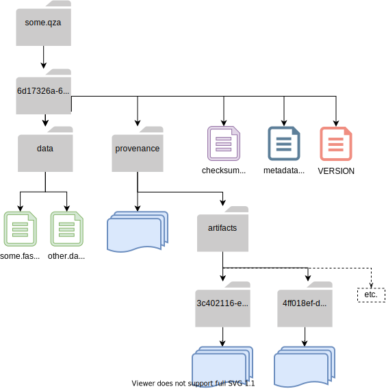

Decentralized Provenance Tracking
=================================
.. contents::
   :local:

QIIME 2 provides automatic, integrated, and decentralized tracking of analysis
metadata, including information about the host system, the computing
environment, Actions performed, parameters passed, primary sources cited, and
more. We describe all of this information about "how an analysis was
performed" as "provenance".

The notion of a QIIME 2 :term:`Result` is central here. Whenever an
:term:`Action` is performed on some data with QIIME 2, the framework
captures relevant metadata about the action and environment and stores it in
the Action's Result. When/if that Result is saved as an :term:`Archive`, the
captured provenance data is stored within the Archive as well. (Saving as an archive 
happens automatically with `q2cli`, and manually with the Artifact API.) For
reference, :ref:`provenance-structure` contains a detailed discussion of the
file structure which holds provenance metadata.

Why Capture Provenance Data?
----------------------------

Provenance gives QIIME 2 users, paper reviewers, and developers valuable
tools for zero-cost documentation, study validation and reproduction,
workflow pipelining, and software maintenance and repair.

Among the benefits of this model are:

- Analyses are *fully* reproducible.
- Analyses self-document, reducing the need for investigator notetaking. For example, q2view produces directed provenance graphs. QIIME 2 Artifacts bring their citations with them. Methods-section text could theoretically be generated from a collection of QIIME 2 Artifacts.
- Analyses are replay-able. The QIIME 2 team is developing functionality to generate executable scripts from prior results, simplifying the repetition of analyses.
- In the unlikely event of a data integrity bug, problematic combinations of hardware, environment, Action, and parameters can be investigated effectively. Impacted results can be programatically identified, and could be programatically correctable in some cases.

By capturing provenance metadata at the level of Actions/Results, QIIME 2
provenance is both host- and interface-agnostic. In other words, a QIIME 2
analysis can be performed across various host systems, using whatever interfaces
the user prefers, without compromising the validity of the analysis or the
provenance. The Result of every step in the analysis contains its own
unique history.

What Provenance Data is Captured?
---------------------------------

In order to focus on provenance data, we will consider a simple QIIME 2
Archive (`.qza`) structure, with limited non-provenance content. Below the
outer :term:`UUID` directory, this :term:`Artifact` holds the data it
produced in a `data` directory (:ref:`data-goes-in-data`), and a few "clerical"
files treated at greater length in :doc:`/storing-data/archive`.



All that's left to discuss is the `provenance/` directory. In the diagram
above, we use a wiggly blue "multiple-files" icon to represent the collection of
provenance data associated with one single QIIME 2 action. When this icon appears
directly within `provenance/` the files describe the "current" :term:`Result`.
All remaining icons appear within the `artifacts/` subdirectory. These file
collections describe all 'parent' Results used in the creation of the current Result,
and are housed in directories named with their respective UUIDs.

.. figure:: ../img/prov_abbreviation.svg
   :alt: A legend indicating how we abbreviate one action's provenance records with single "multiple-files" icon.

With the exception of the current Result (whose provenance lives in `provenance/`,
every Action is captured in a directory titled with the Action's :term:`UUID`. 
That directory contains:

- `VERSION`: :ref:`identifying-an-archive`
- `metadata.yaml`: :ref:`metadata-yaml`
- `citations.bib`: all bibtex-formatted citations registered to the Action
- `action/action.yaml`: a YAML description of the Action and its environmnet. The good stuff!
- [optional] `action/metadata.tsv` or other data files: data captured to provide additional Action context

The `action.yaml` file
``````````````````````

Here, we'll do a deep dive into the contents of a sample visualization's `action.yaml`.
These files are broken into three top-level sections, in this order:

- execution: the Action ID and runtime of the Action that created this Result
- action: Action type, plugin, action, inputs, parameters, etc.
- environment: a non-comprehensive description of the system and QIIME environment where this action was executed

The specific example shown below is avaiable for your perusal at 
`qiime2view <https://view.qiime2.org/provenance/?src=https%3A%2F%2Fdocs.qiime2.org%2F2021.4%2Fdata%2Ftutorials%2Fmoving-pictures%2Fcore-metrics-results%2Funweighted_unifrac_emperor.qzv>`_.
Click on the bottom square in the provenance graph, 
or download and open the archive to peruse the YAML file itself.

The execution block
```````````````````
High-level information about this action and its run time.

.. code-block:: YAML

   execution:
      uuid: 3611a0c1-e5c5-4308-ac92-ebb5968ebafb
      runtime:
          start: 2021-04-21T14:42:16.469998-07:00
          end: 2021-04-21T14:42:21.080381-07:00
          duration: 4 seconds, and 610383 microseconds

Datetimes are formatted <YYYY-MM-DD><'T'><24-hour time><time zone offset>

The `uuid` field captured here is the UUID *of this Action*, and *not of the Result it produced*.
Maintaining separate Result and Action IDs allows us to manage the common case where one Action produces multiple Results.

The action block
````````````````
Details about the action, including action and plugin names, inputs and parameters

.. code-block:: YAML

   action:
      type: pipeline
      plugin: !ref 'environment:plugins:diversity'
      action: core_metrics_phylogenetic
      inputs:
      -   table: 34b07e56-27a5-4f03-ae57-ff427b50aaa1
      -   phylogeny: a10d5d44-62c7-4322-afbe-c9811bcaa3e6
      parameters:
      -   sampling_depth: 1103
      -   metadata: !metadata 'metadata.tsv'
      -   n_jobs_or_threads: 1
      output-name: unweighted_unifrac_emperor
      alias-of: 2adb9f00-a692-411d-8dd3-a6d07fc80a01

The type field describes the *type of action*: a :term:`Method`, :term:`Visualizer`, or :term:`Pipeline`.

The environment block
`````````````````````
.. code-block:: YAML

   environment:
      platform: macosx-10.9-x86_64
      python: |-
          3.8.8 | packaged by conda-forge | (default, Feb 20 2021, 16:12:38)
          [Clang 11.0.1 ]
      framework:
          version: 2021.4.0
          website: https://qiime2.org
          citations:
          - !cite 'framework|qiime2:2021.4.0|0'
      plugins:
          diversity:
              version: 2021.4.0
              website: https://github.com/qiime2/q2-diversity
      python-packages:
          zipp: 3.4.1
          xopen: 1.1.0
          widgetsnbextension: 3.5.1
          wheel: 0.36.2
          webencodings: 0.5.1
          wcwidth: 0.2.5
          urllib3: 1.26.4
          unifrac: 0.20.2
          tzlocal: '2.1'
          typing-extensions: 3.7.4.3
          traitlets: 5.0.5
          tornado: '6.1'
          toml: 0.10.2
          threadpoolctl: 2.1.0
          testpath: 0.4.4
          terminado: 0.9.4
          statsmodels: 0.12.2
          sphinxcontrib-serializinghtml: 1.1.4
          sphinxcontrib-qthelp: 1.0.3
          sphinxcontrib-jsmath: 1.0.1
          sphinxcontrib-htmlhelp: 1.0.3
          sphinxcontrib-devhelp: 1.0.2
          sphinxcontrib-bibtex: 2.2.0
          sphinxcontrib-applehelp: 1.0.2
          Sphinx: 3.5.4
          snowballstemmer: 2.1.0
          six: 1.15.0
          setuptools: 49.6.0.post20210108
          sepp: 4.3.10
          Send2Trash: 1.5.0
          seaborn: 0.11.1
          scipy: 1.6.2
          scikit-learn: 0.24.1
          scikit-bio: 0.5.6
          requests: 2.25.1
          qiime2: 2021.4.0
          q2templates: 2021.4.0
          q2doc: 0.0.0
          q2cli: 2021.4.0
          q2-vsearch: 2021.4.0
          q2-types: 2021.4.0
          q2-taxa: 2021.4.0
          q2-sample-classifier: 2021.4.0
          q2-quality-filter: 2021.4.0
          q2-quality-control: 2021.4.0
          q2-phylogeny: 2021.4.0
          q2-mystery-stew: 2021.4.0
          q2-metadata: 2021.4.0
          q2-longitudinal: 2021.4.0
          q2-gneiss: 2021.4.0
          q2-fragment-insertion: 2021.4.0
          q2-feature-table: 2021.4.0
          q2-feature-classifier: 2021.4.0
          q2-emperor: 2021.4.0
          q2-diversity: 2021.4.0
          q2-diversity-lib: 2021.4.0
          q2-demux: 2021.4.0
          q2-deblur: 2021.4.0
          q2-dada2: 2021.4.0
          q2-cutadapt: 2021.4.0
          q2-composition: 2021.4.0
          q2-alignment: 2021.4.0
          pyzmq: 22.0.3
          PyYAML: 5.4.1
          pytz: '2021.1'
          python-dateutil: 2.8.1
          pytest: 6.2.3
          PySocks: 1.7.1
          pyrsistent: 0.17.3
          pyparsing: 2.4.7
          pyOpenSSL: 20.0.1
          Pygments: 2.8.1
          pycparser: '2.20'
          pybtex: 0.24.0
          pybtex-docutils: 1.0.0
          py: 1.10.0
          ptyprocess: 0.7.0
          psutil: 5.8.0
          prompt-toolkit: 3.0.18
          prometheus-client: 0.10.1
          pluggy: 0.13.1
          pip: 21.0.1
          Pillow: 8.1.2
          pickleshare: 0.7.5
          pexpect: 4.8.0
          patsy: 0.5.1
          parso: 0.8.2
          pandocfilters: 1.4.2
          pandas: 1.2.4
          packaging: '20.9'
          olefile: '0.46'
          numpy: 1.20.2
          notebook: 6.3.0
          nose: 1.3.7
          networkx: 2.5.1
          nest-asyncio: 1.5.1
          nbformat: 5.1.3
          nbconvert: 6.0.7
          nbclient: 0.5.3
          natsort: 7.1.1
          msgpack: 1.0.2
          more-itertools: 8.7.0
          mistune: 0.8.4
          matplotlib: 3.4.1
          MarkupSafe: 1.1.1
          lz4: 3.1.3
          lxml: 4.6.3
          lockfile: 0.12.2
          latexcodec: 2.0.1
          kiwisolver: 1.3.1
          jupyterlab-widgets: 1.0.0
          jupyterlab-pygments: 0.1.2
          jupyter-core: 4.7.1
          jupyter-client: 6.1.12
          jsonschema: 3.2.0
          joblib: 1.0.1
          Jinja2: 2.11.3
          jedi: 0.18.0
          isal: 0.10.0
          ipywidgets: 7.6.3
          ipython: 7.22.0
          ipython-genutils: 0.2.0
          ipykernel: 5.5.3
          iniconfig: 1.1.1
          importlib-metadata: 3.10.1
          imagesize: 1.2.0
          ijson: 3.1.3
          idna: '2.10'
          hdmedians: 0.14.2
          h5py: 3.2.1
          gneiss: 0.4.6
          future: 0.18.2
          fastcluster: 1.1.26
          entrypoints: '0.3'
          emperor: 1.0.3
          docutils: '0.16'
          dnaio: 0.5.0
          DendroPy: 4.5.2
          defusedxml: 0.7.1
          decorator: 4.4.2
          deblur: 1.1.0
          Cython: 0.29.23
          cycler: 0.10.0
          cutadapt: '3.4'
          cryptography: 3.4.7
          click: 7.1.2
          chardet: 4.0.0
          cffi: 1.14.5
          certifi: 2020.12.5
          cached-property: 1.5.2
          CacheControl: 0.12.6
          brotlipy: 0.7.0
          bokeh: 2.3.1
          bleach: 3.3.0
          biom-format: 2.1.10
          bibtexparser: 1.1.0
          backports.functools-lru-cache: 1.6.4
          backcall: 0.2.0
          Babel: 2.9.0
          attrs: 20.3.0
          async-generator: '1.10'
          argon2-cffi: 20.1.0
          appnope: 0.1.2
          alabaster: 0.7.12
          q2galaxy: 2021.4.0